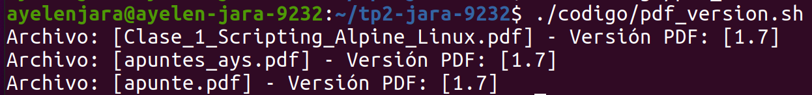
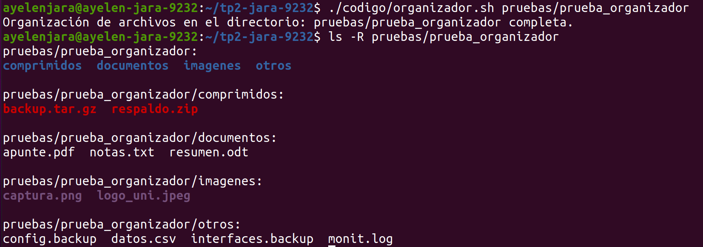
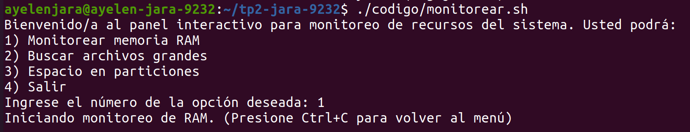
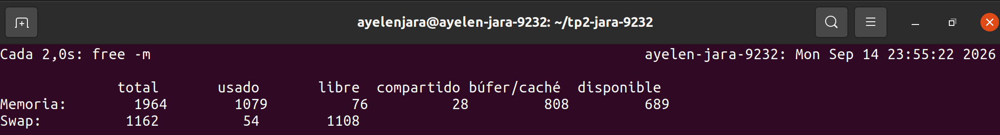
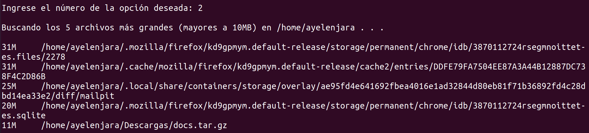
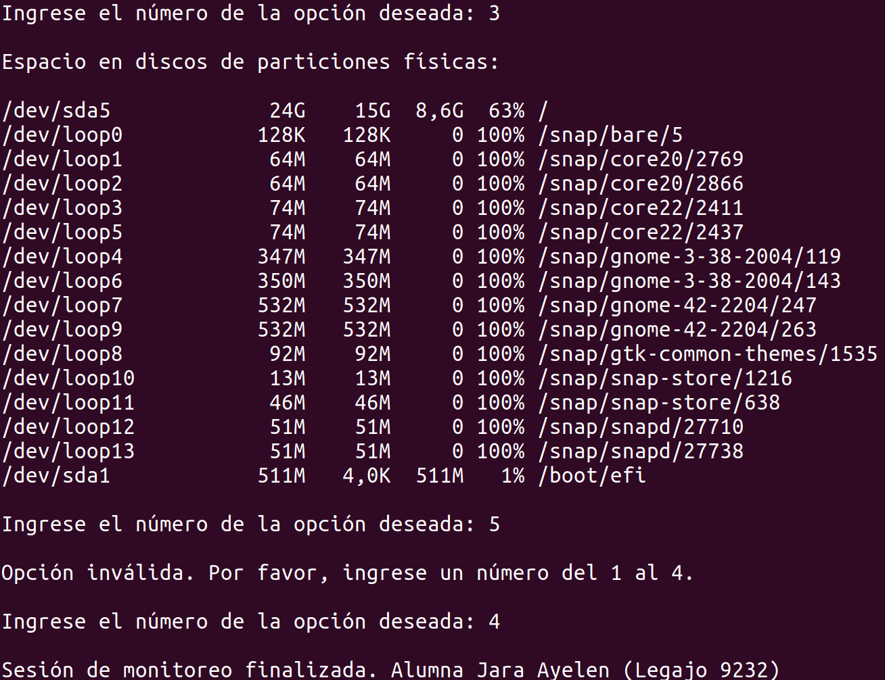
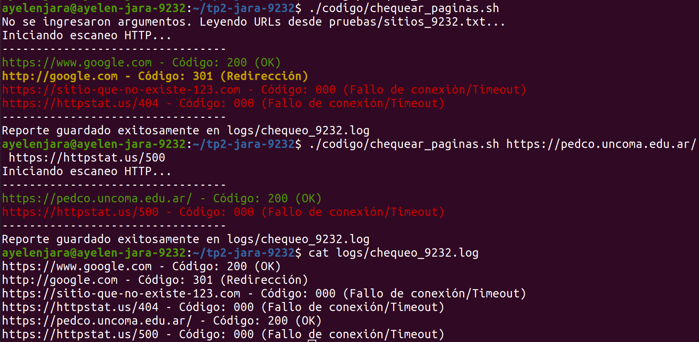
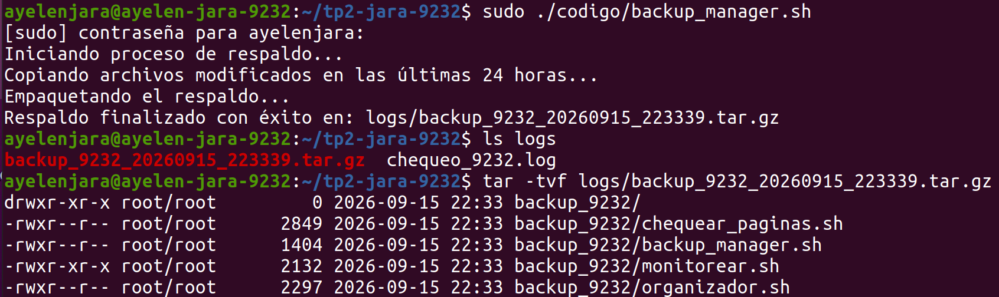
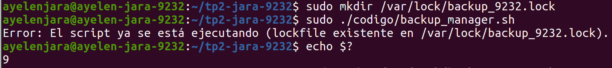

# Trabajo Práctico N° 2 - Scripts Avanzados en Bash

**Carrera:** Tecnicatura Universitaria en Administración de Sistemas y Software Libre  
**Asignatura:** Automatización y Scripting  
**Alumna:** Jara Ayelen  
**Legajo N°:** 9232  

## Descripción
El presente repositorio contiene la resolución del Trabajo Práctico N° 2 de la asignatura Automatización y Scripting. El mismo se enfoca en la implementación de scripts en Bash, utilizando bucles complejos, arreglos, manipulación de cadenas en variables, control de procesos concurrentes mediante archivos de bloqueo (lockfiles), interacción con servicios web mediante cURL y creación de interfaces interactivas en la terminal.

## Estructura del Proyecto
* `codigo/`: Contiene los scripts desarrollados.
* `logs/`: Guarda los archivos de reportes y las copias de seguridad empaquetadas que se generan al ejecutar el código.
* `pruebas/`: Contiene los archivos de texto y directorios utilizados para probar el funcionamiento de los scripts.
* `capturas/`: Capturas de pantalla de la terminal mostrando la ejecución exitosa de los scripts.

## Scripts Desarrollados
1. **pdf_version.sh**: Busca archivos PDF en el directorio de trabajo, extrae su versión de formato leyendo la primera línea y omite aquellos que coinciden con patrones de exclusión.

2. **organizador.sh**: Clasifica y ordena archivos en subcarpetas según su extensión. Además, renombra masivamente los archivos `.old` a `.backup` utilizando sustitución de cadenas.

3. **monitorear.sh**: Despliega un panel interactivo mediante un menú `select` que permite monitorear la memoria RAM en tiempo real, buscar archivos grandes en el sistema y visualizar el espacio en las particiones físicas.

  
4. **chequear_paginas.sh**: Verifica la disponibilidad de una lista de sitios web mediante peticiones HTTP silenciosas con `cURL`, devolviendo el código de estado formateado en colores e informando en un archivo log.

5. **backup_manager.sh**: Ejecuta un respaldo comprimido de los scripts modificados en las últimas 24 horas. Implementa un mecanismo de "lockfile" (bloqueo atómico) con el comando `trap` para prevenir la corrupción de datos por ejecuciones simultáneas.

